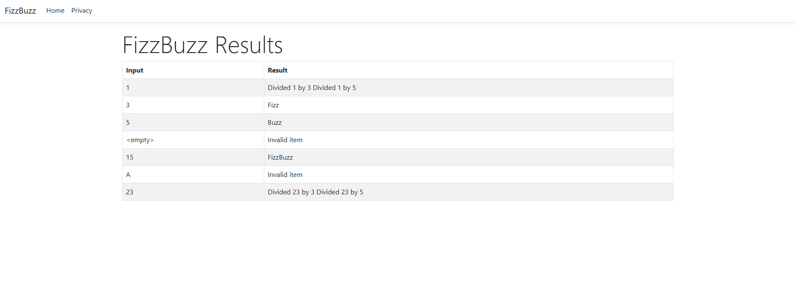

# FizzBuzz Overview
FizzBuzz projects which takes in an input array and generate output based on certain rules.

### Assumptions
* Input is not sent from the UI, instead a hard coded array with the inputs from the assignment are hard coded in HomeController.
* Authentication not included

### Project scaffolding
For this programming assignment, I've used ASP.NET Core Web App (MVC) project template as a base.

### Project Setup
Based on the base, the architecture of the webapp has the following 5 projects
* FizzBuzz webapp
* FizzBuzz.Services (Abstracting the logic from the webapp)
* FizzBuzz.Models (Common models)
* FizzBuzz.Services.UnitTests
* FizzBuzz.IntegrationTests

### CI/CD
* For CI, used github actions to build the project and run tests (unit and integration)
* For CD, the project is packaged as a docker container and used for deployment.

### Deployment
* For deploying the project, I've used Azure Appservice running the docker container.