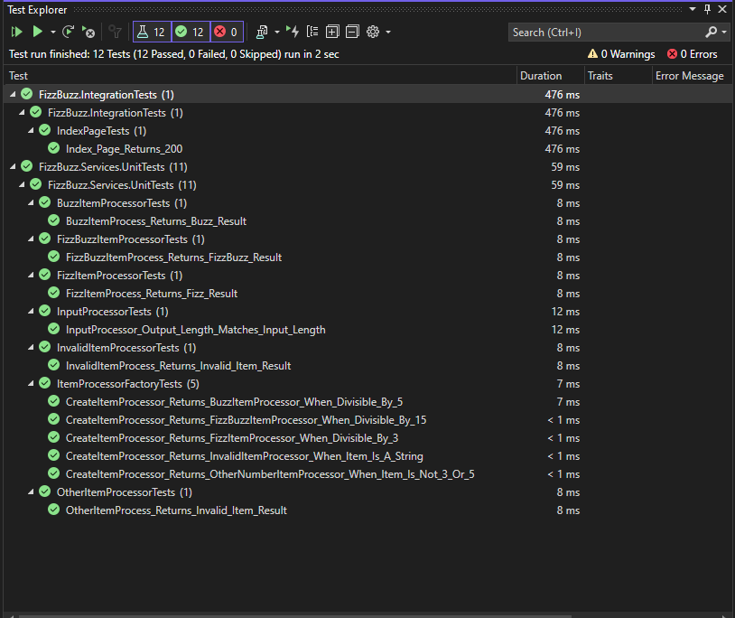

# FizzBuzz Overview
FizzBuzz takes in an input array and generate output based on certain rules.

### Rules
* Value multiple of 3, shows "Fizz" in Result column
* Value multiple of 5, shows "Buzz" in Result column
* Value multiple of both 3 & 5, shows "FizzBuzz" in Result column


### Assumptions
* Input is not sent from the UI, instead a hard coded array with the inputs from the assignment are used in HomeController.
* Authentication not included

### Project Scaffolding
For this programming assignment, I've used ASP.NET Core Web App (MVC) project template as a base.

### Project Setup
Based on the base, the architecture of the webapp has the following 5 projects
* FizzBuzz webapp
* FizzBuzz.Services (Abstracting the logic from the webapp)
* FizzBuzz.Models (Common models)
* FizzBuzz.Services.UnitTests
* FizzBuzz.IntegrationTests

### CI/CD
* For CI, used github actions to build the project and run tests (unit and integration)
* For CD, the project is packaged as a docker container and used for deployment.

### Deployment
* For deploying the project, I've used Azure Appservice running the docker container.

### Local setup
To run the project locally, run the following command
Choose your directory of choice. Assuming you have a directory named `projects` in your documents folder. 

```
git clone https://github.com/srujanakasina/FizzBuzz.git
cd FizzBuzz
dotnet build .\src\FizzBuzz\FizzBuzz.csproj
dotnet run --project .\src\FizzBuzz\FizzBuzz.csproj
```

After running the above commands, navigate to `http://localhost:5116` to view the web app running.

If you are using Visual Studio, you should be able to proess the play button and the webpage should come automatically.

### Running tests
Project includes both Unit tests & Integration tests. Run the following commands with in the project directory in powershell

#### Running Unit Tests for FizzBuzz Services
```
cd .\src\FizzBuzz.Services.UnitTests\
dotnet test
```

#### Running Integration test for FizzBuzz
```
cd .\src\FizzBuzz.IntegrationTests\
dotnet test
```

#### Running in Visual Studio
Use test explorer to run these tests with in visual studio


